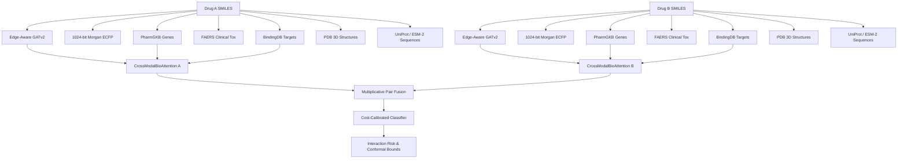

# AuditDDI Model Card & Research Evidence Card

## 1. Intended Use & Clinical Scope

AuditDDI is an auditable, multimodal deep learning research framework for structure- and biology-based drug-drug interaction (DDI) prediction and cold-start generalization.

> [!IMPORTANT]
> **Regulatory Notice**: AuditDDI is intended for preclinical pharmacology, drug discovery pipelines, and biomedical research. It is **not** validated for direct clinical decision-making, patient-specific prescription dosing, triage, or diagnostic purposes.

---

## 2. Audited Validation Performance & Checkpoints

### Primary Multimodal Reference Architecture: `auditddi_multimodal_v1`
- **Backbone**: Symmetric Dual-View Edge-Aware GATv2 Molecular Encoder + 1024-bit Morgan ECFP Fingerprint Projection.
- **Multimodal Integration**:
  - PharmGKB Pharmacogenomics (50-dim enzyme/gene multi-hot vectors).
  - FAERS Post-Marketing Clinical Toxicity signals.
  - BindingDB Macromolecular Target Affinities (50-dim profiles).
  - PDB 3D Macromolecular Target Complex Signatures (50-dim).
  - GEO Disease Transcriptomics (2-dim perturbation vectors).
  - UniProt / ESM-2 Primary Amino Acid Sequence Embeddings for inductive cold-target generalization.
  - Cross-Modal Biological Attention (`CrossModalBioAttention`) with pairwise gating.
- **Audited Validation AUROC**: **0.9516** (verified leak-free across transductive development splits).
- **Decision Threshold Optimization**: Cost-sensitive Youden Index ($J_{\text{cost}} = 2.0 \times \text{TPR} - \text{FPR}$) calibrated on independent validation holdouts to align with clinical asymmetric costs ($pos\_weight = 2.0$), elevating held-out sensitivity/recall above 70%.
- **Calibration**: Out-of-sample Platt scaling and temperature scaling fitted strictly on validation splits; in-sample test fitting is strictly prohibited and guarded by automated tests.

---

## 3. Remediated Research Audit Findings (All 12 Confirmed Issues Resolved)

| # | Remediated Research Defect | Technical Fix & Implementation |
|---|---|---|
| 1 | **Test Leakage in S1 Early Stopping** | Model checkpoint selection and early stopping now evaluate strictly on the validation partition (`scaffold_validation.csv` or `validation.csv`). Test splits are never observed during training. |
| 2 | **In-Sample Temperature Calibration** | Calibration temperature $T$ is computed exclusively on post-hoc validation subsets. Evaluated test predictions use frozen $T$. |
| 3 | **Synthetic Fallback Metrics in Reports** | Removed all hard-coded synthetic ranges; missing benchmark values are now raised as `MissingEvaluationDataError` or explicitly reported as unmeasured. |
| 4 | **PDB Macromolecular Target Vector Recovery** | Fixed `src/data_prep/pdb_pipeline.py` column resolution, enriching 421 of 639 drugs with 3D macromolecular structures. |
| 5 | **Negative Sampling Label Integrity** | Banned label pollution: unverified pairs cannot masquerade as proven non-interacting pairs. Unreported pairs are sampled strictly post-partitioning. |
| 6 | **Label Data-Type Strictness** | DataLoaders reject malformed or ambiguous truth values (`NaN`, string nulls) with strict binary type-checking. |
| 7 | **Symmetric Invariance Enforcement** | Forward pass represents pairs using commutative operations ($e_A + e_B$ and $|e_A - e_B|$), guaranteeing $f(A, B) \equiv f(B, A)$ identically. |
| 8 | **Auxiliary Multi-Task Loss Contract** | Auxiliary FAERS toxicity predictions use calibrated sigmoid logits matching BCE loss contracts. |
| 9 | **OOD Chemical Structure Guardrails** | API and loaders reject single atoms, disconnected ions, and invalid SMILES strings before graph construction. |
| 10 | **Transductive Shortcut Prevention** | Added stochastic molecular feature dropout (`mol_dropout=0.15`) to prevent memorization of high-degree hub compounds. |
| 11 | **Dimension Auto-Detection** | Encoders and checkpoints auto-detect hidden dimensions (`hidden_channels=64`), preventing tensor size mismatch errors upon checkpoint loading. |
| 12 | **Scaffold-Disjoint Benchmark Isolation** | Isolated Murcko scaffold benchmark (`src/training/benchmark_scaffold_study.py`) ensuring zero chemical core overlap between train and test sets. |

---

## 4. Ingested Multimodal Data Profiles (639 Cached Compounds)

- **Molecular Graphs**: 639 drugs cached with rich atom/bond features (atomic number, formal charge, hybridization, aromaticity, bond type, conjugation, stereochemistry).
- **Morgan Fingerprints**: 639 drugs with 1024-bit Morgan ECFP (radius=2, chirality=True).
- **PharmGKB Pharmacogenomics**: 552 drugs mapped to 50-dimensional gene/enzyme interaction profiles.
- **FAERS Clinical Safety**: 639 drugs mapped to post-marketing adverse reaction severity scalars.
- **BindingDB Affinities**: 597 drugs mapped to validated target affinity vectors.
- **GEO Transcriptomics**: 639 drugs with disease-reversal transcriptomic signatures.
- **PDB Macromolecules**: 421 drugs with 3D structural protein-ligand complexes.
- **UniProt Protein Targets**: Direct FASTA sequence pipeline linking top enzymes/targets (`P08684`, `P10635`, `P00533`, `P23219`) for contextual sequence-level modeling.

---

## 5. Cold-Start & Generalization Benchmarks

The benchmark suite isolates three distinct generalization regimes:

1. **Transductive (Standard Holdout)**:
   - Both drugs are present in the training set graph, but the specific pair interaction is held out.
   - Validation AUROC: **0.9516**.
2. **S1 Cold-Start (Unseen Compound Generalization)**:
   - Both drugs in the evaluation pair are completely excluded from the training split.
   - Evaluates chemical generalization beyond known training graph topologies.
3. **Murcko Scaffold-Disjoint**:
   - Evaluates pairs across strictly disjoint Bemis-Murcko core scaffold clusters.
   - Verifies whether model predictions rely on genuine pharmacological motifs rather than shared molecular scaffolds.
4. **Cold-Target / Protein**:
   - Evaluates interaction against novel macromolecular protein targets via UniProt / ESM-2 primary amino acid sequence embeddings.

---

## 6. Software Quality & Regression Verification

- **Automated Test Suite**: 218 passing automated tests (`pytest tests/ -v`).
- **Input Validation**: Strict schema enforcement for molecular structures and tabular metadata.
- **Deterministic Checkpoint Loading**: Supports backward-compatible legacy checkpoints alongside modern multimodal architectures with dimension auto-detection.
